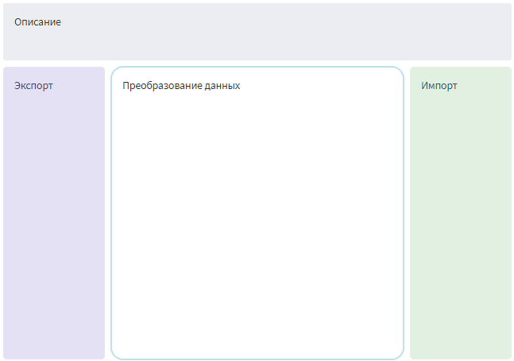
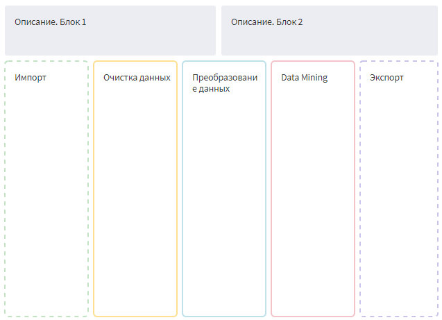

# Шаблоны для data-истории

* Версия: 1.0.0
* Проверено: Все редакции Loginom 7.0.3

Для удобства создания data-истории мы предлагаем вам воспользоваться готовыми шаблонами. Возьмите за основу базовый шаблон для небольших сценариев или расширенный, если предполагается многоступенчатая обработка данных.

## Базовый шаблон

Шаблон: [base_template.lgp](data-history-templates/base_template.lgp)

## Расширенный шаблон

Шаблон: [extended_template.lgp](data-history-templates/extended_template.lgp)

Выберите подходящий для вашей задачи шаблон и начните в нем разработку сценария. При создании узла сразу размещайте его на соответствующей заметке. Таким образом вы быстро сформируете data-историю.

Кроме того, вы можете использовать шаблон в уже готовом сценарии. Скопируйте его целиком и вставьте в текущий модуль пакета. Далее вы сможете распределить узлы сценария по соответствующим блокам шаблона.